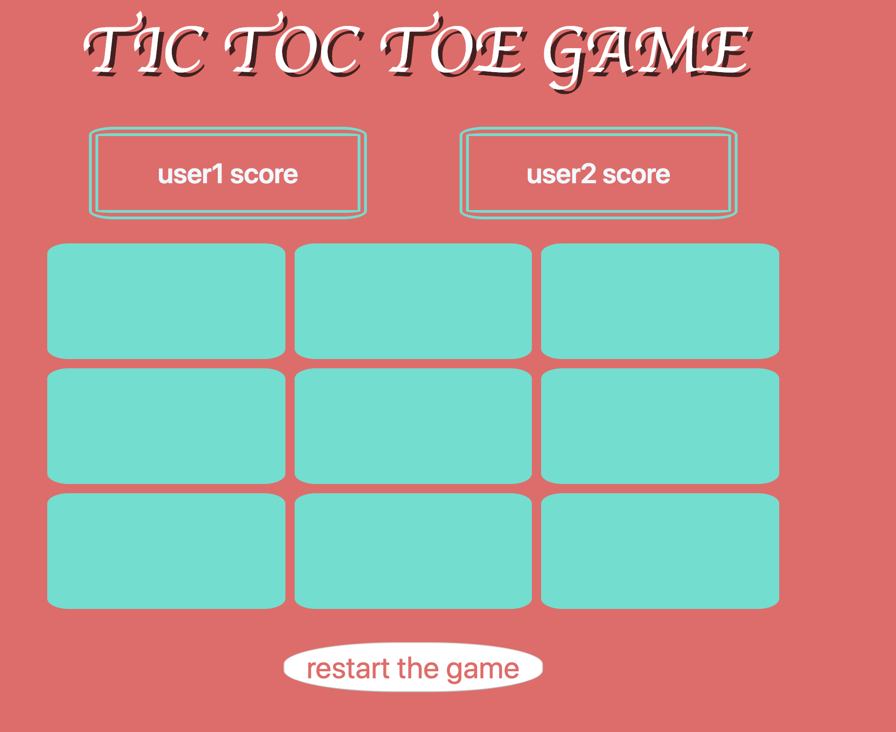
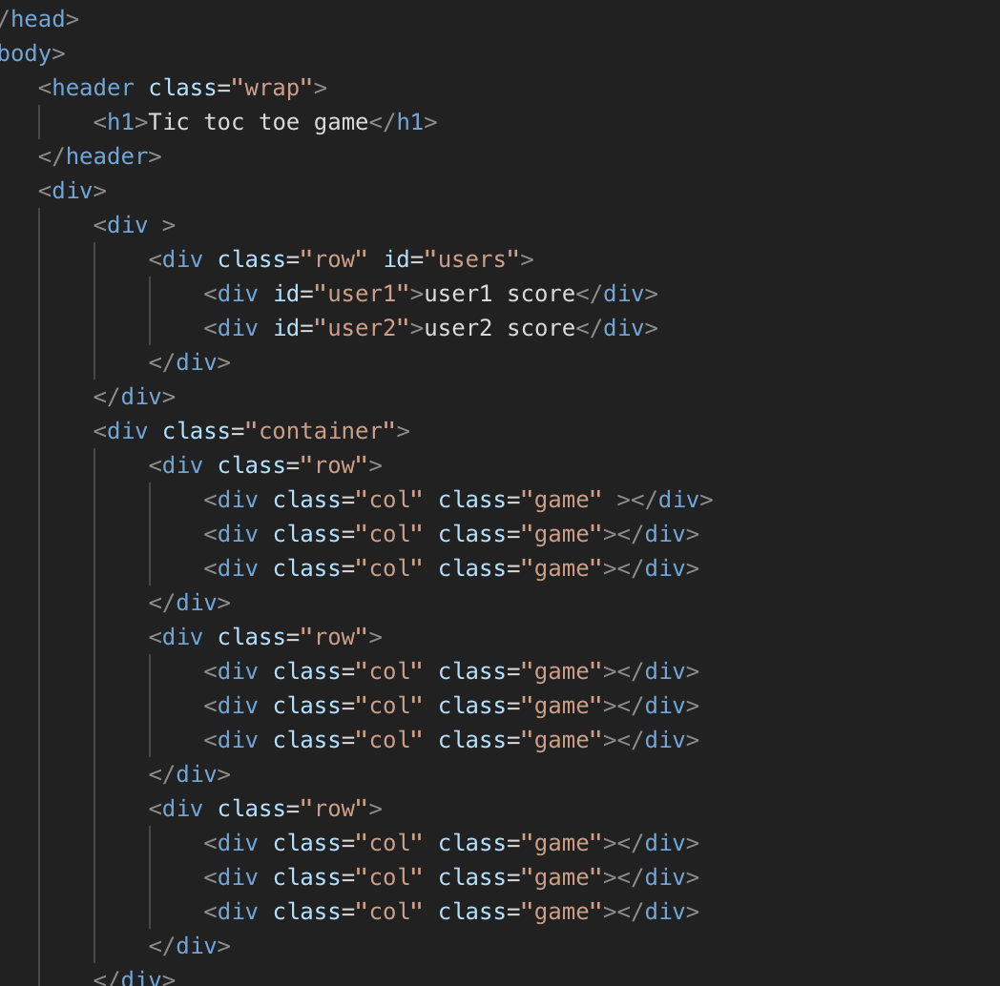
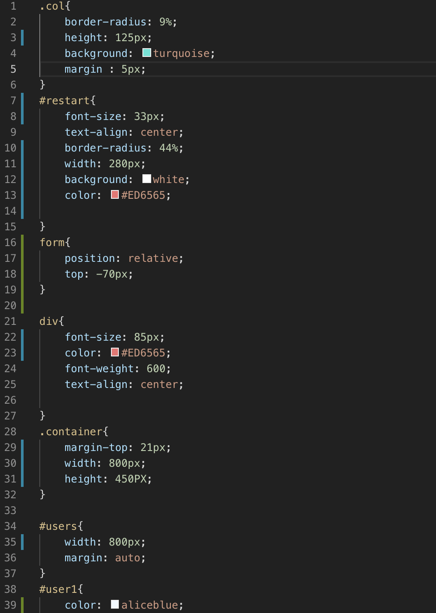
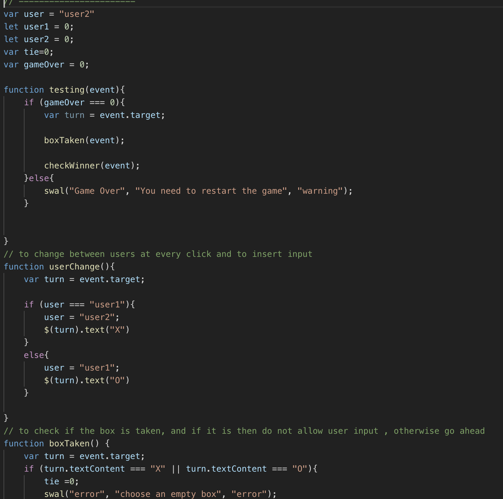

## Tic Tac Toe



##snippets of my code [HTML, CSS, JS]





##logic

to know who won, I made a function that will go through all these conditions and returns the winner, otherwise it will be tie.
as this function will be called inside the main function everytime a click happen
```
(boxIndex[0].textContent === win && boxIndex[1].textContent === win && boxIndex[2].textContent === win) 
        ||
(boxIndex[3].textContent === win && boxIndex[4].textContent === win && boxIndex[5].textContent === win) 
        ||
(boxIndex[6].textContent === win && boxIndex[7].textContent === win && boxIndex[8].textContent === win) 
        ||
(boxIndex[0].textContent === win && boxIndex[4].textContent === win && boxIndex[8].textContent === win) 
        ||
(boxIndex[0].textContent === win && boxIndex[3].textContent === win && boxIndex[6].textContent === win) 
        ||
(boxIndex[1].textContent === win && boxIndex[4].textContent === win && boxIndex[7].textContent === win) 
        ||
(boxIndex[2].textContent === win && boxIndex[5].textContent === win && boxIndex[8].textContent === win) 
        ||
(boxIndex[2].textContent === win && boxIndex[4].textContent === win && boxIndex[6].textContent === win) 
       
```

##Difficult parts in the project
1-finding bugs,
2- trying to create an AI, which was my favourite part

##Upcoming features
1-finish the AI
2-asking for users name
3-be more creative with the styling

##Tools
[Bootstrap]()
[jQuerey]()
[sweetAlert]()
[SkewedTypefaceByKurtEmch]()

##Acknowledgements

*Moath
*Usman
*Mike
*Ayman
*Ahemd
*Abdullah


